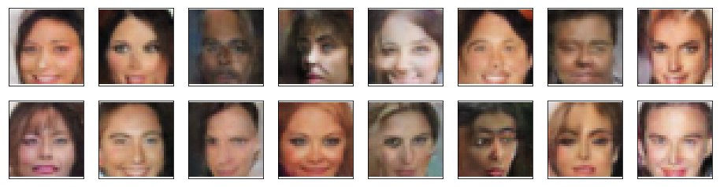

# Face Generation

In this project, a DCGAN is defined and trained on a dataset of faces. The goal is to get a generator network to generate *new* images of faces that look as realistic as possible!

The project is broken down into a series of tasks from **loading in data to defining and training adversarial networks**. At the end of the notebook, the results of the trained Generator are visualised to see how it performs; the generated samples look like fairly realistic faces with small amounts of noise.

### Data

[CelebFaces Attributes Dataset (CelebA)](http://mmlab.ie.cuhk.edu.hk/projects/CelebA.html) is used to train your adversarial networks.

Each of the CelebA images has been cropped to remove parts of the image that don't include a face, then resized down to 64x64x3 NumPy images. Some sample data is show below.

> This dataset can be downloaded [here](https://s3.amazonaws.com/video.udacity-data.com/topher/2018/November/5be7eb6f_processed-celeba-small/processed-celeba-small.zip).

## Generator samples from training

The image size is set to `32x32`for faster training, while still creating convincing images of faces. These are the samples of images from the generator after 50 epochs.

